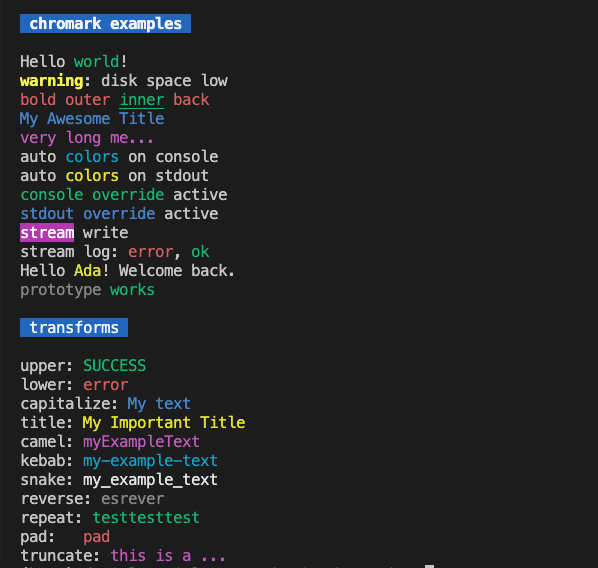

# chromark

Colorize and transform console output using §-based inline tags.

## Showcase



## Why

- **Inline styling**: keep your messages readable while adding colors/transforms where needed.
- **No runtime lock-in**: works with Bun and Node.
- **Composability**: nest tokens and apply text transforms alongside visual styles.

## Install

```bash
bun add chromark
# or
npm i chromark
```

## Quick start

```ts
import { applyColors, c, enableAutoColors, disableAutoColors, color } from 'chromark'

console.log(applyColors('§green|upper:success§ §red:error§'))

enableAutoColors()
console.log('§blue|title:my title§ and §bgYellow|black:highlight§')
disableAutoColors()

console.log(c('§magenta|capitalize:custom helper§'))

console.log(color`Hello §yellow:world§!`)
```

## Usage

### ESM (Bun/Node)

```ts
import { applyColors } from 'chromark'
console.log(applyColors('§green:ok§'))
```

### CommonJS (Node)

```js
const { applyColors } = require('chromark')
console.log(applyColors('§green:ok§'))
```

### Auto overrides

```ts
import { enableAutoColors, disableAutoColors } from 'chromark'
enableAutoColors({ console: true, stdout: true })
console.log('§yellow:highlight§')
disableAutoColors()
```

### Nested styles and transforms

```ts
import { applyColors as a } from 'chromark'
console.log(a('§red:outer §green|underline:inner§ back§'))
console.log(a('§blue|title:my nice title§'))
console.log(a('§magenta|truncate=8:very long text here§'))
```

### Syntax

- **Basic**: `§style:text§`
- **Multiple styles**: separate with `|`, e.g. `§red|bold:text§`
- **Nested**: `§red:outer §green|underline:inner§ outer§`
- **Transforms**: `upper`, `lower`, `capitalize`, `title`, `camel`, `kebab`, `snake`, `reverse`, `repeat=3`, `pad=10` (optional filler: `pad=10=_`), `truncate=8` (optional suffix: `truncate=8=..`)

## API

- **applyColors(text)**: returns a new string with ANSI escapes applied.
- **c(text)**: alias for `applyColors`.
- **enableConsoleOverride() / disableConsoleOverride()**: override console methods to auto-apply.
- **enableStdoutOverride() / disableStdoutOverride()**: override `process.stdout.write`.
- **ColoredOutputStream**: wrapper stream with `write` and `log` methods.
- **enableStringPrototypeExtension()**: adds `String#color()`.
- **color**: template literal tag that applies colors to the resulting string.
- **enableAutoColors(options?)**: enable multiple overrides at once.

## Run the examples

```bash
bun run example
```

## Compatibility

- Bun 1.0+ and Node 18+.
- ESM and CJS builds are provided. Type definitions are referenced from `index.ts`.

## Publishing & releases

- Publishing is automated via GitHub Actions.
- Create a git tag `vX.Y.Z` on `main` to trigger a release workflow.

## Troubleshooting

- If ANSI colors do not show, confirm your terminal supports ANSI and `process.stdout.isTTY === true`.
- For Windows, modern terminals (Windows Terminal, VSCode) work best.

## License

MIT © Daniel Lucas Silva
